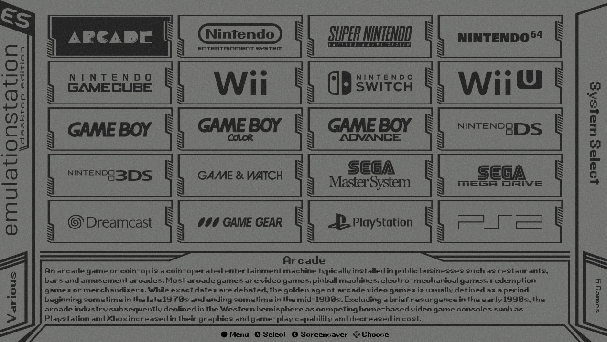
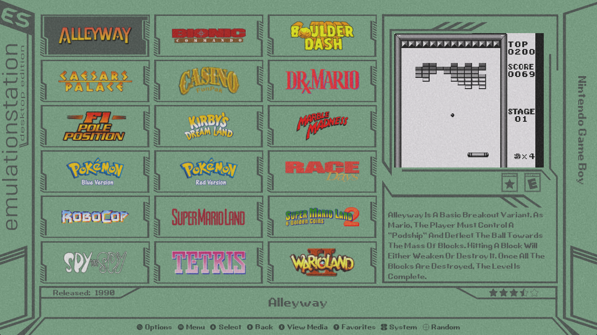

# Razor for EmulationStation Desktop Edition (razot-es-de)

Razor is an old school lcd inspired theme

The following options are included:

2 variants:

- Grid with metadata
- Grid without metadata

18 color schemes:

- Game & Watch
- Game & Watch (lcd font)
- Game & Watch (alt font)
- Gameboy
- Gameboy (lcd font)
- Gameboy (alt font)
- Classy
- Classy (lcd font)
- Classy (alt font)
- Blue LCD
- Blue LCD (lcd font)
- Blue LCD (alt font)
- Dark
- Dark (lcd font)
- Dark (alt font)
- Yellow
- Yellow (lcd font)
- Yellow (alt font)

4 aspect ratios:

- 16:9
- 16:10
- 4:3
- 21:9

3 transitions:

- Instant
- Instant and slide
- Instant and fade

